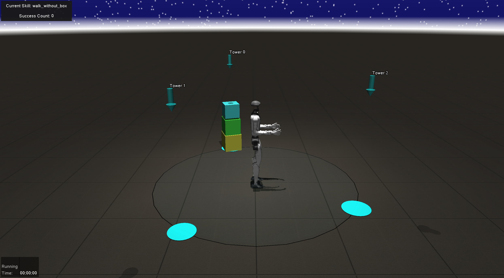
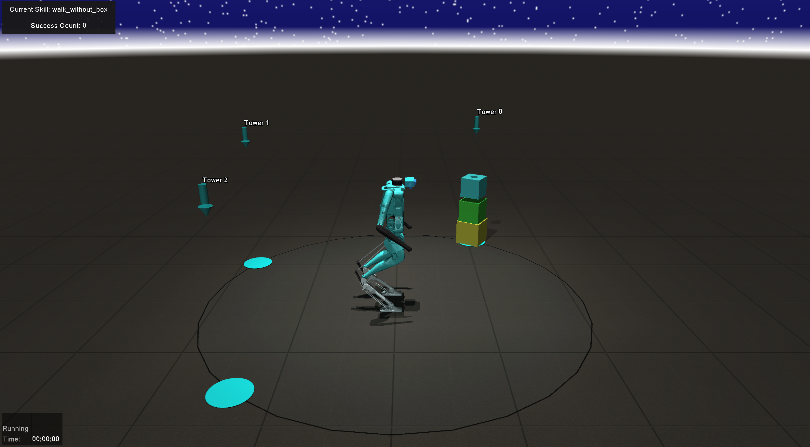

# Humanoid Hanoi: Investigating Shared Whole-Body Control for Skill-Based Box Rearrangement 📦

**Minku Kim**<sup>†</sup>, **Kuan-Chia Chen**<sup>†</sup>, Aayam Shrestha, Li Fuxin, Stefan Lee, and Alan Fern

[📄 Paper](https://arxiv.org/abs/2602.13850) | [🌐 Website](https://osudrl.github.io/Humanoid_Hanoi/) | [📖 BibTeX](#citing-humanoid-hanoi)


<div align="center">

| H1 Robot | G1 Robot | Digit Robot |
|:--------:|:--------:|:-----------:|
|  |  |  |
| *H1 humanoid robot* | *G1 humanoid robot* | *Digit humanoid robot* |

</div>

## Setup Instructions

Conda is required to run the setup script included with this repository. To avoid licensing issues with Anaconda, it is recommended you install conda on your machine via [Miniconda](https://docs.anaconda.com/miniconda/) rather than Anaconda.

To create a fresh conda environment with all the necessary dependencies, run the following commands at the root directory of this repository:

```bash
chmod +x setup.bash
bash setup.bash
```

This script will:
- Set up a new conda environment
- Install additional pip packages
- Install mujoco210

## Usage

To evaluate the environment, run `eval.py` with the `--robot` flag to specify which robot to use:

```bash
python eval.py --robot <robot_name>
```

### Robot Options

The `--robot` flag accepts one of the following options:

- `"h1"` - H1 humanoid robot
- `"g1"` - G1 humanoid robot  
- `"digit"` - Digit humanoid robot (default)

### Additional Flags

- `--offscreen`: Run the evaluation without a display window

### Interactive Controls

During interactive evaluation, press the `'r'` key to reset the environment.

## Note

⚠️ **This repository contains only the environment implementation. Training code is NOT included.**

## Citing Humanoid Hanoi

If you find this repository useful, please consider giving a star ⭐ and citation 📦:

```bibtex
@misc{kim2026humanoidhanoiinvestigatingshared,
      title={Humanoid Hanoi: Investigating Shared Whole-Body Control for Skill-Based Box Rearrangement}, 
      author={Minku Kim and Kuan-Chia Chen and Aayam Shrestha and Li Fuxin and Stefan Lee and Alan Fern},
      year={2026},
      eprint={2602.13850},
      archivePrefix={arXiv},
      primaryClass={cs.RO},
      url={https://arxiv.org/abs/2602.13850}, 
}
```